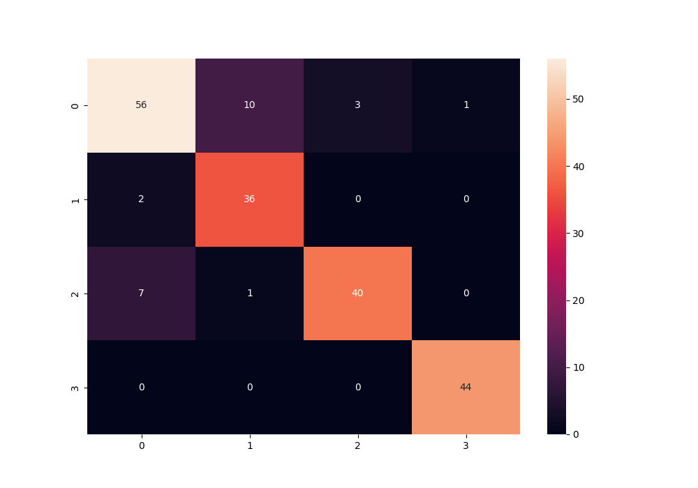
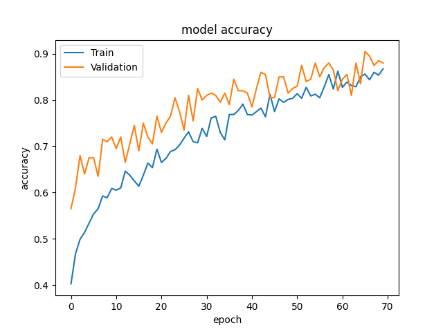
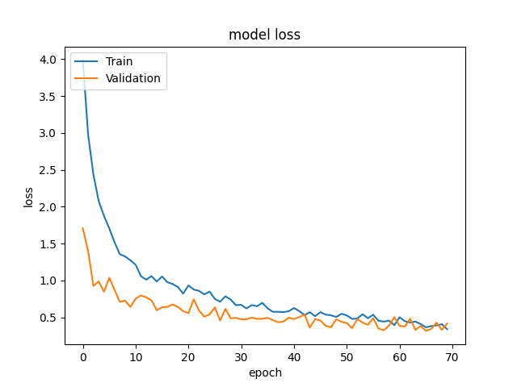

# Chest Cancer Detection using Vision Transformer

## Description
This project implements a Vision Transformer model to detect chest cancer. The dataset used is sourced from Kaggle.

## Results
The Vision Transformer model achieved promising results in detecting chest cancer. It demonstrated high accuracy and reliable performance in classifying chest images.

  
  
  

